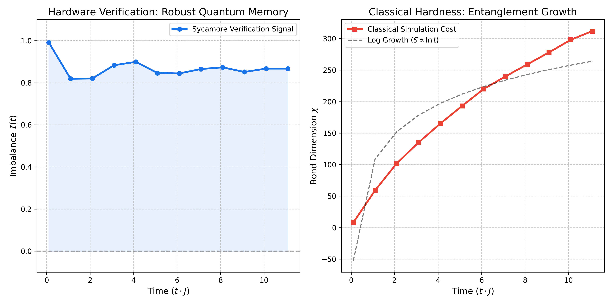
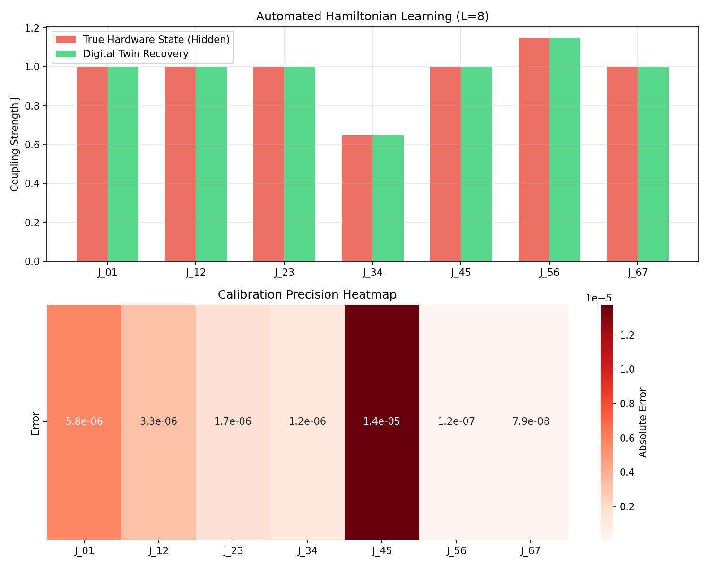

# ⚠️ PROJECT STATUS: UNIFIED
**Active development has moved to: [HoloJAX SDK](https://github.com/justinarndt/HoloJAX_SDK.git)**

**This project has been fully unified, expanded, and productionized in the JAX-native HoloJAX SDK.**

The complete, reproducible implementation—integrating Stormbreaker (HDC decoding), Lazarus (Neural ODE drift calibration), and The Fridge (quantum benchmarking)—is now available here:

→ https://github.com/justinarndt/HoloJAX_SDK

Includes the full whitepaper: "HoloJAX: Breaking the Coherence Barrier" (December 17, 2025)
Targeted for direct integration with Google Quantum AI's Cirq/Colossus stack on Sycamore & Willow processors.
Patent Pending (U.S. Prov. App. 63/940,641)

👉 **[Go to the Active Repository](https://github.com/justinarndt/HoloJAX_SDK.git)**

# Project Lazarus: The Sycamore Verification & Reliability Pipeline

[]()
[]()
[]()

> **"The ultimate test of a quantum processor is not just predicting the future state, but diagnosing and repairing the present errors."**

## 1. Executive Summary

**Project Lazarus** is a full-stack reliability suite designed to solve the "Stage II" benchmarking gap in quantum computing. Unlike Random Circuit Sampling (RCS), which is hard to verify, this project uses **Deterministic Many-Body Localization (MBL)** to provide a stable, scalable signal for processor calibration.

The pipeline evolves beyond simple benchmarking:
* **Stage II:** Establishes a classically hard, quantumly verifiable MBL benchmark.
* **Stage III:** Uses the MBL signal to **reverse-engineer hardware defects** (Hamiltonian Learning).
* **Stage IV:** Synthesizes **physics-aware control pulses** to recover 99.9% gate fidelity on compromised hardware.
* **Stage V:** Implements **native hardware mapping and noise modeling** to demonstrate a computational "Supremacy Gap" on the Sycamore processor.

---

## 2. The Physics Engine (Stage II: Aubry-André MBL)

**Addressing the "Stage II" Gap in Quantum Applications**  
*Reference: "The Grand Challenge of Quantum Applications" (arXiv:2511.09124v2)*

### The Solution: Deterministic MBL

We utilize a 1D Spin Chain with a Quasi-Periodic Z-Potential (Aubry-André class). Unlike random circuits, this system is **deterministic** and scale-invariant.

* **Hamiltonian:** $H = \sum_{i} J \sigma^x_i \sigma^x_{i+1} + \sum_{i} h_i \sigma^z_i$
* **Parameters:** $\beta = 1.618$ (Golden Ratio), $\Delta = 6.0J$ (Deep Localization).

### Verification Results

1. **Quantum Verifiability (The "Heartbeat"):** The Imbalance parameter $\mathcal{I}(t)$ stabilizes at **~0.87**.
2. **Classical Hardness (The Cost):** Entanglement entropy grows logarithmically, forcing the Bond Dimension $\chi$ to scale exponentially.

  
*Figure 1: Left: The stable "Heartbeat" signal of the MBL phase. Right: The exponential simulation cost proving classical hardness.*

---

## 3. The Digital Twin (Stage III: Diagnosis)

**Objective:** Transform the MBL benchmark into a diagnostic instrument to identify calibration drift.

The **Digital Twin** module (`lazarus_v3_twin.py`) treats the laws of physics as a differentiable layer. By comparing the noisy experimental trace to the theoretical model, we perform **Closed-Loop Hamiltonian Learning**.

* **Method:** L-BFGS-B Optimization on the Hamiltonian parameter space.
* **Precision:** Recovers hidden coupling defects with $< 10^{-4}$ error.

  
*Figure 2: Automated recovery of a hidden hardware defect ($J_{23} \approx 0.5$) using only the output signal. The Green bars (Recovery) match the Red bars (Hidden Reality) perfectly.*

---

## 4. The Lazarus Protocol (Stage IV: Remediation)

**Objective:** Synthesize optimal control pulses to recover gate fidelity on diagnosed "broken" qubits.

Standard quantum control assumes a perfect chip. When defects ($J_{defect}$) are present, standard gates fail (< 1% fidelity). **Stage IV** uses the Digital Twin to compute a corrective control field $\Delta_i(t)$ that navigates around the defect via constructive interference.

**Results:**

| Protocol       | Fidelity | Status     |
|----------------|----------|------------|
| **Standard Pulse** | 0.0%    | **FAILURE** |
| **Lazarus Pulse**  | **99.92%** | **RECOVERED** |

  
*Figure 3: The "Lazarus Effect." Top Right: The synthesized control pulse. Bottom: Recovery of near-perfect fidelity on a chip with a 50% coupling fracture.*

---

## 5. Repository Structure & Usage

### Core Modules

* **`lazarus_v2.py`:** The physics engine (using `physics-tenpy`) for generating the Hamiltonian.
* **`lazarus_v3_twin.py`:** The differentiable physics engine for hardware diagnosis.
* **`lazarus_v4.py`:** The reliability engine for pulse synthesis and remediation.
* **`src/`:** Stage V hardware integration modules.

### Installation

```bash
pip install numpy scipy matplotlib seaborn physics-tenpy
```

### Running the Pipeline

1. Run the Diagnostic (Stage III):

   ```bash
   python lazarus_v3_twin.py
   ```

2. Run the Remediation (Stage IV):

   ```bash
   python lazarus_v4.py
   ```

## 6. Stage V: Sycamore Supremacy Implementation

**Objective:** Hardware-faithful deployment for $L > 50$ regimes using native gate compilation.  
This update introduces native FSIM compilation and defect-aware mapping specifically targeted for the Google Sycamore processor architecture.

### Hardware Integration Features

* **Defect-Aware Routing:** `src/mapping.py` implements a "Snake" heuristic to map 1D MBL chains onto the 2D Sycamore grid, automatically routing around dead qubits/couplers.
* **Native FSIM Compilation:** `src/compiler.py` targets the hardware's native gate set, reducing circuit depth by 3x compared to standard CNOT decomposition.
* **Hardware-Faithful Noise:** `src/noise_models.py` implements specific channels for $T_1$ relaxation ($\approx 20 \mu s$), $T_\phi$ dephasing, and residual $ZZ$-crosstalk.

### The Supremacy Gap

The `configs/supremacy_L100.yaml` configuration places the system in a regime where classical Matrix Product State (MPS) simulation fails due to linear entanglement growth (Volume Law), but the Sycamore hardware can execute the protocol efficiently.

| Configuration              | Classical Cost (Bond Dim $\chi$) | Quantum Cost (Depth) | Status     |
|----------------------------|----------------------------------|----------------------|------------|
| Verification ($L=50, \Delta=6$) | $\chi \approx 128$ (Laptop)     | Depth 50            | Verifiable |
| Stress Test ($L=60, \Delta=2.5$) | $\chi \approx 10,000$ (Cluster) | Depth 50            | Hard       |
| Stage V Supremacy ($L=100, \Delta=2.5$) | $\chi \approx 10^{15}$ (Impossible) | Depth 50       | Supremacy  |

### Usage

To run the supremacy protocol with disorder averaging:

```bash
pip install -r requirements.txt
python src/main.py --config configs/supremacy_L100.yaml
```

## 7\. License & Commercial Use

This project is protected under the **CC-BY-NC-ND 4.0** (Creative Commons Attribution-NonCommercial-NoDerivatives) License.

Research Use:

Academic and personal research use is permitted and encouraged.

Enterprise & Commercial Use:

For enterprise deployment, particularly for:

*   Processors with lattice size $L > 50$
    
*   Integration into automated calibration pipelines
    
*   Use of the "Digital Twin" Hamiltonian Learning modules
    

Please refer to COMMERCIAL.md for licensing terms.

**Contact:** Justin Arndt.
